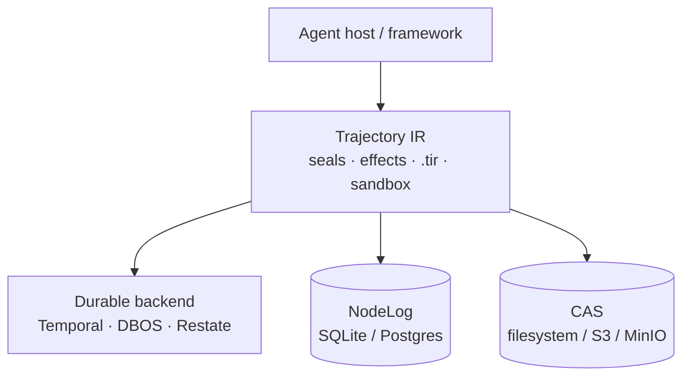

Trajectory IR is a thin semantic layer. It does **not** replace Temporal, DBOS, or Restate.

## High-level picture

| Layer | Role |
|---|---|
| Agent host | Your loop / framework (LangGraph, custom, MCP host, …) |
| Trajectory IR | Seal decisions, classify effects, export/verify `.tir` |
| Durable backend | Crash-safe steps, retries, leases |
| NodeLog | Append-only IR metadata (SQLite or Postgres) |
| CAS | Content-addressed artifacts (local FS or S3/MinIO) |

## Durable backends

| Backend | Typical use |
|---|---|
| **Temporal** | Go production path |
| **DBOS** | Python reference path |
| **Restate** | Optional adapter |

## Packages and conformance

- Package signatures **shipped**: `trajir-pkg-sig-v1` (R09–R11)
- Conformance covers **R01–R11** (not only R01/R02)
- Python durable adapter path: `drivers/durable_backend/` (underscore)

## For maintainers

CI depth, OpenSSF Scorecard, CodeQL, and related gates live in the engine repo — see [docs/CI_HARDENING.md](https://github.com/Coder-s-OG-s/Trajectory-IR/blob/main/docs/CI_HARDENING.md). Fluid / `k8s-fluid` caching is optional / future, not required to use Trajectory IR.

## Next

- [Concepts](/docs/concepts)
- [How it fits](/docs/how-it-fits)
- [SDK Reference](/docs/api)
