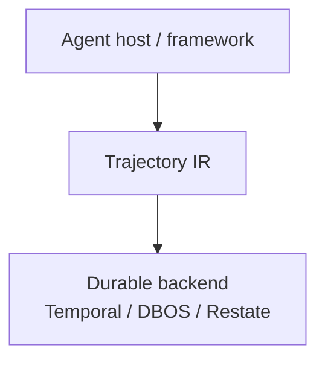

## What it is / is not

| Trajectory IR **is** | Trajectory IR **is not** |
|---|---|
| A portable IR + `.tir` package format | A replacement for Temporal / DBOS / Restate |
| Seals, effect classes, resume *semantics* | An agent orchestration framework (not LangGraph) |
| A thin layer over pluggable durable backends | A long-term memory product (not Mem0 / Zep) |
| Open source libraries (Apache-2.0) | A hosted multi-tenant SaaS |

---

## How it relates to other systems

| System | What it solves | What Trajectory IR adds |
|---|---|---|
| Temporal / DBOS / Restate | Crash safety, retries, leases | Agent seals, effect classes, portable `.tir` |
| LangGraph / CrewAI / ADK | Orchestration & checkpoints | Framework-agnostic export of what ran |
| MCP tool hints | Basic tool safety vocabulary | Mapping into six effect classes + resume matrix |
| Mem0 / Zep | Long-term memory recall | Optional LTM node shapes only — not a recall product |

Trajectory IR sits **between** your agent host and a durable backend. You keep Temporal (or DBOS / Restate) for execution durability; you add seals and portable packages for agent-specific safety and auditability.

---

## Industry context (not product metrics)

These numbers describe the broader agent ecosystem. They are **not** Trajectory IR latency, throughput, or win-rate claims.

> In LangSmith usage data published by LangChain (State of AI 2024), traces with tool calls rose from **0.5% to 21.9%**, and average steps per trace rose from **2.8 to 7.7**.

> A VentureBeat Pulse (July 2026, n=108 organizations with 100+ employees) reported that **49%** had shipped an agent that passed internal evaluations and then failed with customers.

Always treat the above as **industry context** with citations and caveats.

---

## Next

- [Go Quickstart](/docs/quickstart)
- [Core concepts](/docs/concepts)
- [Architecture](/docs/architecture)
- Engine [SCOPE_AND_NON_GOALS](https://github.com/Coder-s-OG-s/Trajectory-IR/blob/main/docs/SCOPE_AND_NON_GOALS.md)
