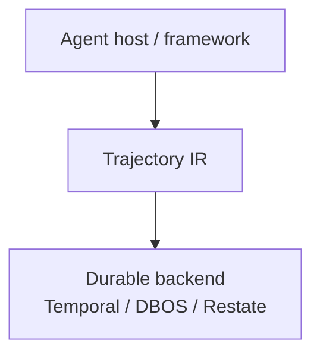

**Portable, hash-verifiable intermediate representation for agent execution trajectories.**

Trajectory IR is the flight recorder and safety switch for agent runs: seal the model’s plan before side effects, classify tool effects, resume without re-inventing the plan, and export a runtime-independent `.tir` package anyone can verify by content hash. It sits **on top of** durable execution engines (Temporal, DBOS, Restate) — it does not replace them, and it is not another agent framework.



```text
  Agent host / framework     (LangGraph, custom loops, MCP hosts, …)
            │
            ▼
  ┌─────────────────────────────┐
  │       Trajectory IR         │  seals · effect classes · .tir · sandbox
  └─────────────────────────────┘
            │
            ▼
  Durable backend              (Temporal · DBOS · Restate)
```

---

## Failure today → what Trajectory IR adds

| Failure today | What Trajectory IR adds |
|---|---|
| Crash mid-tool → retry double-fires a write | Block-and-gate + durable backend memoization |
| Resume re-asks the model → silent plan drift | Sealed `DECISION` is the plan; resume replays it |
| History locked in one framework | Portable thin/fat `.tir` with hash-checked node IDs |
| Demo can charge / email / deploy for real | Sandbox mode blocks dangerous effect classes |

---

## Who is this for?

| Audience | Start here |
|---|---|
| Students / newcomers | [Go Quickstart](/docs/quickstart) → [Sandbox demo](/docs/demos/sandbox) |
| Agent / platform engineers | [How it fits](/docs/how-it-fits) → [Concepts](/docs/concepts) |
| Security / compliance | Seals + [`.tir`](/docs/api/tir-package) + [Security](/docs/security) |
| Contributors | [Contributing](/docs/contributing) · Go first for new features |
| AI coding agents | Engine [master spec](https://github.com/Coder-s-OG-s/Trajectory-IR/blob/main/docs/MASTER_SPECIFICATION.md) — implement the spec, don’t invent APIs |

---

## Next steps

import { Cards, Card } from 'fumadocs-ui/components/card';

<Cards>
  <Card title="Quickstart (Go)" href="/docs/quickstart" description="Primary path: clone, go test, minimal client." />
  <Card title="How it fits" href="/docs/how-it-fits" description="Honest is / is-not vs Temporal, LangGraph, memory products." />
  <Card title="Demos" href="/docs/demos" description="Adoption host, sandbox, kill-mid-deploy." />
  <Card title="Contribute" href="/docs/contributing" description="DCO, Go-first features, website vs engine PRs." />
</Cards>

---

## Status (honest)

- Spec: `spec-v0.2-draft`
- Phase: **1C harden and adopt** (Go primary; Python reference / parity)
- License: Apache-2.0
- [OpenSSF Best Practices](https://www.bestpractices.dev/projects/14075)
- CNCF Sandbox: **preparing** — not claimed as membership
- Adopters: none listed yet — [empty is honest](/docs/adopters)

[](https://www.bestpractices.dev/projects/14075)
