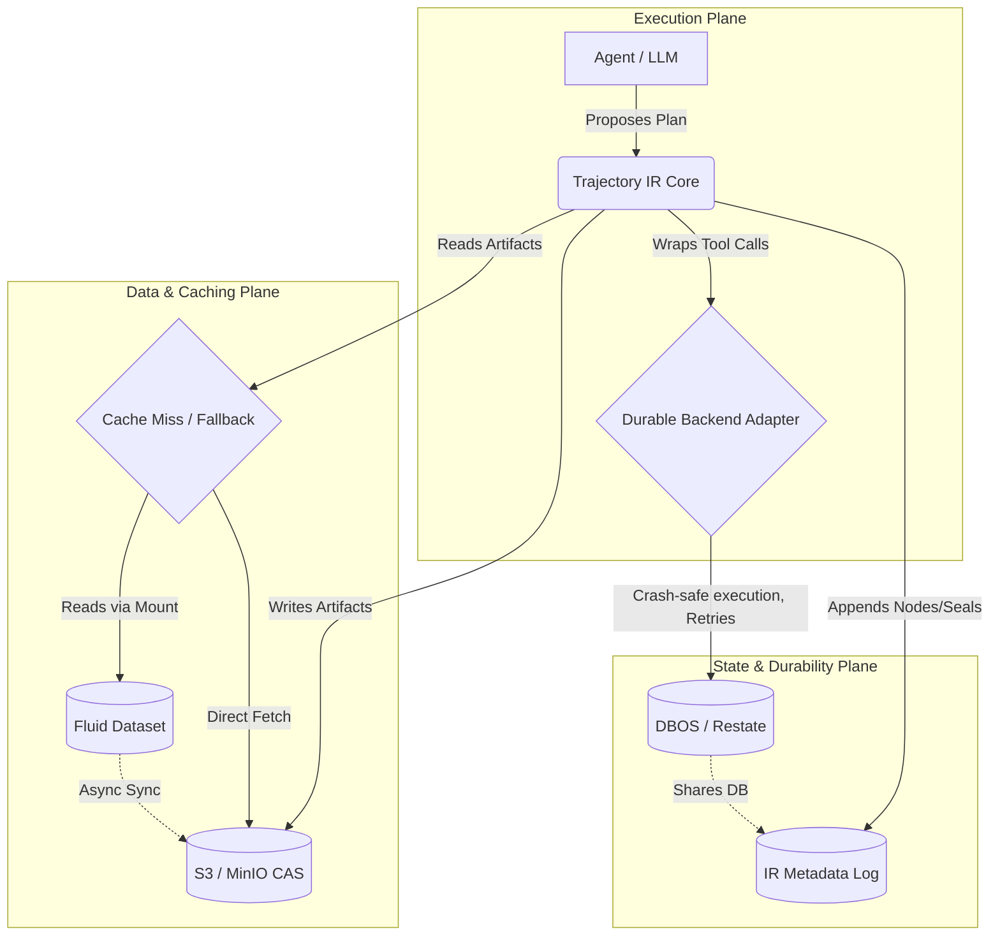
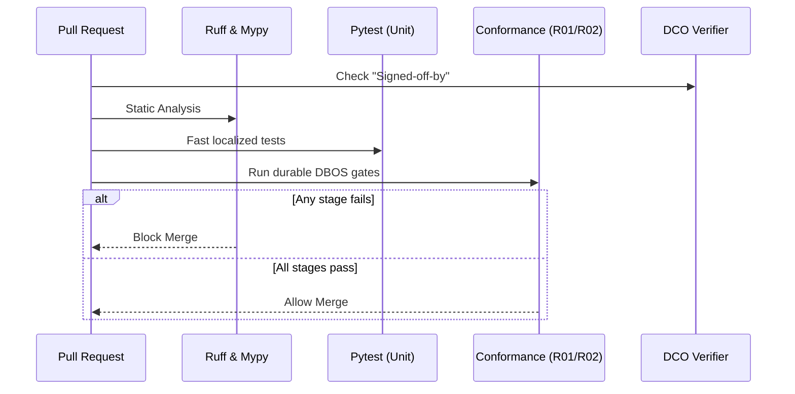

This document serves as the absolute blueprint for Trajectory IR. It defines both the **production architecture** (how the system runs) and the **developer infrastructure** (how we build, test, and ship this project day-to-day).

---

## Part 1: Production Infrastructure & Architecture

Trajectory IR operates as a semantic layer over existing execution and storage primitives. It is divided into three operational planes.

### 1.1 System Architecture & Component Interaction



### 1.2 Storage Mechanics & Schemas

**IR Metadata Log (SQLite/Postgres)**
- `trajectories`: `trajectory_id` (PK), `tenant_id`, `status`.
- `nodes`: `node_id` (PK, computed via RFC 8785 JCS + SHA256), `trajectory_id`, `seq`, `kind`, `payload`.
- `seals`: `seal_id` (PK), `node_id` (FK), `signature`.

**Sharded CAS Object Store (S3/Filesystem)**
Artifacts are sharded by the first two hex characters of their SHA256 hash to prevent bucket listing degradation:
```text
s3://<bucket_name>/cas/<shard_prefix>/<full_hash>
# Example: s3://trajir/cas/e3/b0c4...
```

### 1.3 Deployment Profiles

| Profile | Target Environment | Execution | Database | Storage | Caching |
|---|---|---|---|---|---|
| `local` | Dev / Phase 1A | DBOS (Embedded) | SQLite | Local FS | None |
| `server-s3` | Single-Region API | DBOS / Restate | PostgreSQL | AWS S3 | None |
| `k8s-fluid` | Enterprise Fleets | K8s Deployments | PostgreSQL | AWS S3 | Fluid FUSE |

---

## Part 2: Developer Infrastructure

To ensure high quality, deterministic builds, and rapid iteration, we enforce strict developer infrastructure protocols.

### 2.1 The Local Developer Environment

1. **Python Toolchain**:
   - Version: **Python 3.11+**
   - Package Manager: **Hatch** (via `pyproject.toml`) for deterministic dependency resolution.
   - Linting & Formatting: **Ruff** (replaces Flake8, Black, Isort).
   - Type Checking: **Mypy** (Strict mode enabled for all core IR packages).

2. **Core Dependencies**:
   - `canonicaljson`: For RFC 8785 strict hashing.
   - `dbos-transact`: For the embedded durable execution Phase 1A backend.
   - `pytest` & `pytest-cov`: For the conformance suite.

### 2.2 AI Agent Workflow (ECC Integration)

This repository is maintained by Human owners collaborating with AI Agents. We mandate the following agent workflow:

1. **Planner Agent**: Must be invoked for any new architecture or module to draft an `implementation_plan.md` before coding.
2. **TDD-Guide Agent**: All modules in `pkg/` and `drivers/` are built test-first. Test coverage must exceed 80%.
3. **Security-Review Agent**: Must be invoked before merging any modifications to `pkg/effects/` (tool safety boundaries) and `pkg/resume/` (block-and-gate logic).

### 2.3 CI/CD Pipeline (GitHub Actions)

Every pull request runs through a strict automated pipeline:



- **DCO Sign-off**: Every commit must carry a Developer Certificate of Origin (`Signed-off-by: Name <email>`).
- **Conformance Gates**: Features are not complete unless tests `R01` (Safe Resume) and `R02` (Block-and-Gate) pass cleanly.

### 2.4 Codebase Mapping

When building, code must be placed strictly according to this physical infrastructure layout:

- **`spec/`**: Design docs.
- **`pkg/trajectory_ir/runtime/`**: Core logic (Nodes, Trajectory logic, JCS hashing). No DBOS/backend code belongs here.
- **`pkg/trajectory_ir/effects/`**: Tool safety classes and MCP mappings.
- **`pkg/trajectory_ir/resume/`**: The block-and-gate protocol semantics.
- **`drivers/durable-backend/dbos/`**: The ONLY place where DBOS imports and workflow step wrappers exist.
- **`conformance/`**: The R01-R08 tests that prove the drivers work. 
- **`examples/kill-mid-deploy/`**: A runnable E2E harness demonstrating crash-safety in the real world.

<Callout type="warn">
**Boundary Violation Rule**: The `pkg/trajectory_ir/runtime/` module must **never** import `dbos`. All durable execution logic must remain completely isolated behind the interface in `drivers/durable-backend/`.
</Callout>
