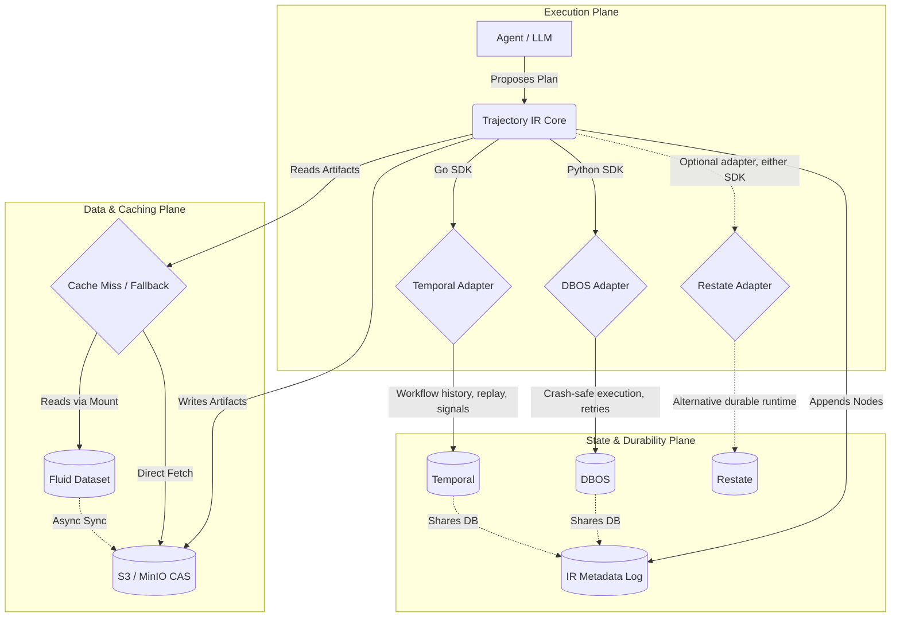
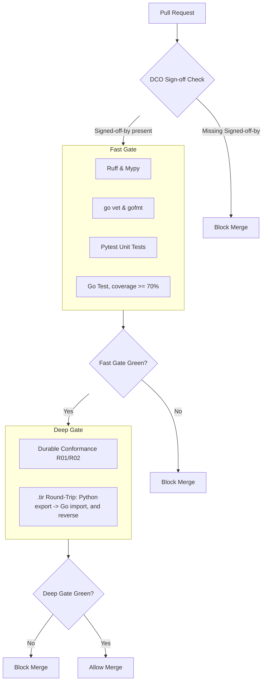

This document serves as the absolute blueprint for Trajectory IR. It defines both the **production architecture** (how the system runs) and the **developer infrastructure** (how we build, test, and ship this project day-to-day).

---

## Part 1: Production Infrastructure & Architecture

Trajectory IR operates as a semantic layer over existing execution and storage primitives. It is divided into three operational planes.

### 1.1 System Architecture & Component Interaction

The Python SDK and Go SDK take different paths through the durability plane. Python runs on DBOS by default (Phase 1A), while the Go SDK is built around Temporal as its production backend. Restate remains an optional adapter for either language and is not required for either default path.



### 1.2 Storage Mechanics & Schemas

**IR Metadata Log (SQLite/Postgres)**

There is a single `nodes` table. Earlier drafts of this document described separate `trajectories` and `seals` tables, but neither is persisted in the real implementation (`pkg/trajectory_ir/runtime/log.py`, mirrored in `drivers/postgres`).

- `nodes`: `id` (PK), `trajectory_id`, `tenant_id`, `step_n`, `seq`, `kind`, `payload_json`, `ts`.

<Callout type="info">
There is no `trajectories` table and no `seals` table. A trajectory's identity and status are derived by reading its `nodes` rows, and seal records are derived from `DECISION`-kind nodes at `.tir` export time rather than stored as a separate row.
</Callout>

**Sharded CAS Object Store (S3/Filesystem)**
Artifacts are sharded by the first two hex characters of their SHA256 hash to prevent bucket listing degradation:
```text
s3://<bucket_name>/cas/<shard_prefix>/<full_hash>
# Example: s3://trajir/cas/e3/b0c4...
```

### 1.3 Deployment Profiles

The `Execution` column below distinguishes the Python/DBOS path from the Go/Temporal path, since they are genuinely different stacks rather than interchangeable backends for the same SDK.

| Profile | Target Environment | Execution | Database | Storage | Caching |
|---|---|---|---|---|---|
| `local` | Dev / Phase 1A | Python SDK + DBOS (Embedded) | SQLite | Local FS | None |
| `server-s3` | Single-Region API | Python SDK + DBOS / Restate | PostgreSQL | AWS S3 | None |
| `k8s-fluid` | Enterprise Fleets | Go SDK + Temporal | PostgreSQL | AWS S3 | Fluid FUSE |

DBOS's embedded, single-process model is a good fit for the `local` and `server-s3` profiles the Python SDK targets. `k8s-fluid` fleets need independent worker pools, workflow history and replay, and signals for the block-and-gate protocol, which is why the Go SDK is built on Temporal rather than DBOS. See [Why Go Uses Temporal](/docs/api-go/durable-temporal) for the full reasoning.

---

## Part 2: Developer Infrastructure

To ensure high quality, deterministic builds, and rapid iteration, we enforce strict developer infrastructure protocols.

### 2.1 The Local Developer Environment

1. **Python Toolchain**:
   - Version: **Python 3.11+**
   - Package Manager: **Hatch** (via `pyproject.toml`) for deterministic dependency resolution.
   - Linting & Formatting: **Ruff** (replaces Flake8, Black, Isort).
   - Type Checking: **Mypy** (Strict mode enabled for all core IR packages).

2. **Core Dependencies**:
   - `canonicaljson`: For RFC 8785 strict canonical hashing.
   - `dbos`: For the embedded durable execution Phase 1A backend.
   - `pytest` & `pytest-cov`: For the conformance suite.

### 2.2 AI Agent Workflow (ECC Integration)

This repository is maintained by human owners collaborating with AI agents (specifically the Antigravity IDE and the Everything Claude Code [ECC] specialized subagent suite). As documented in the Master Specification Section 15, we mandate the following developer and AI workflow:

1. **Planner Agent**: Must be invoked for any new architecture or module to draft an `implementation_plan.md` before coding.
2. **TDD-Guide Agent**: All modules in `pkg/` and `drivers/` are built test-first. Test coverage must exceed 80%.
3. **Security-Review Agent (Procedural Governance Gate)**: Must be invoked before merging any modifications to `pkg/effects/` (tool safety boundaries) and `pkg/resume/` (block-and-gate logic). Unlike automated CI checks, this is a mandatory procedural code review and human maintainer sign-off policy designed to ensure maximum scrutiny on sensitive boundary logic.

### 2.3 CI/CD Pipeline (GitHub Actions)

The pipeline is split into a fast gate and a deep gate. The fast gate runs static analysis and unit tests for both SDKs on every push; the deep gate runs the slower durable-conformance and cross-language suites and only starts once the fast gate is green.



- **DCO Sign-off (Automated Hard Gate)**: Every commit must carry a Developer Certificate of Origin (`Signed-off-by: Name <email>`). Commits without this are hard-blocked by CI.
- **Fast Gate**: Ruff and Mypy for Python, `go vet` and `gofmt -l` for Go, plus the Pytest and Go unit suites. The Go coverage floor was recently raised from 50% to 70%; a PR that drops below it fails the gate.
- **Deep Gate**: The `R01` (Safe Resume) and `R02` (Block-and-Gate) durable conformance tests, plus a `.tir` cross-language round-trip gate that exports a trajectory with the Python SDK and imports it with the Go SDK, and the reverse, checking the decoded nodes match byte-for-byte.
- **Security & Architectural Sign-off (Procedural Review Policy)**: Changes modifying tool effect classification or block-and-gate resumption require explicit procedural peer review and human maintainer approval before PR merge, independent of the automated gates above.

### 2.4 Codebase Mapping

When building, code must be placed strictly according to this physical infrastructure layout.

**Python (`pkg/`, `drivers/`)**

- **`spec/`**: Design docs.
- **`pkg/trajectory_ir/runtime/`**: Core logic (Nodes, Trajectory logic, JCS hashing, the `nodes` table log). No DBOS/backend code belongs here.
- **`pkg/trajectory_ir/effects/`**: Tool safety classes and MCP mappings.
- **`pkg/trajectory_ir/resume/`**: The block-and-gate protocol semantics.
- **`drivers/durable-backend/dbos/`**: The ONLY place where DBOS imports and workflow step wrappers exist.
- **`drivers/postgres/`**: The Postgres mirror of the `nodes` table log.
- **`conformance/`**: The R01-R08 tests that prove the drivers work.
- **`examples/kill-mid-deploy/`**: A runnable E2E harness demonstrating crash-safety in the real world.

**Go (`go/trajir/`)**

- **`go/trajir/client`**: The Go SDK entry point (`Trajectory`, `OpenTrajectory`, `Resume`).
- **`go/trajir/durable/temporal`**: The ONLY place where Temporal imports and workflow definitions exist, mirroring `drivers/durable-backend/dbos/` on the Python side.
- **`go/trajir/cas`**: Client for the sharded S3/MinIO content-addressable store.
- **`go/trajir/effects`**: The Go `EffectClass` values, kept in lockstep with `pkg/trajectory_ir/effects/`.
- **`go/trajir/resume`**: The Go implementation of the block-and-gate protocol.
- **`go/trajir/sandbox`**: Tool execution sandboxing for `ExecTool`.
- **`go/trajir/redact`**: Field redaction for `.tir` exports built with `redacted: true`.
- **`go/trajir/tir`**: `.tir` package export and import, kept format-compatible with the Python side.
- **`go/trajir/nodes`**: JCS canonicalization and node hashing, matching the Python `runtime` package byte-for-byte.
- **`go/trajir/log`**: The Go side of the `nodes` table log, equivalent to `pkg/trajectory_ir/runtime/log.py`.
- **`go/trajir/projector`**: Projects the node log into the materialized state returned by `Project()`.
- **`go/trajir/postgres`**: The Postgres driver used by the `server-s3` and `k8s-fluid` profiles.
- **`go/conformance`**: The Go side of the R01-R08 conformance suite plus the `.tir` cross-language round-trip tests.
- **`go/examples`**: Runnable Go examples, the counterpart to `examples/kill-mid-deploy/`.

<Callout type="warn">
**Boundary Violation Rule**: The `pkg/trajectory_ir/runtime/` module must **never** import `dbos`, and `go/trajir/nodes` and `go/trajir/log` must never import `go/trajir/durable/temporal`. All durable execution logic must remain completely isolated behind the interface in `drivers/durable-backend/` (Python) or `go/trajir/durable/` (Go).
</Callout>
